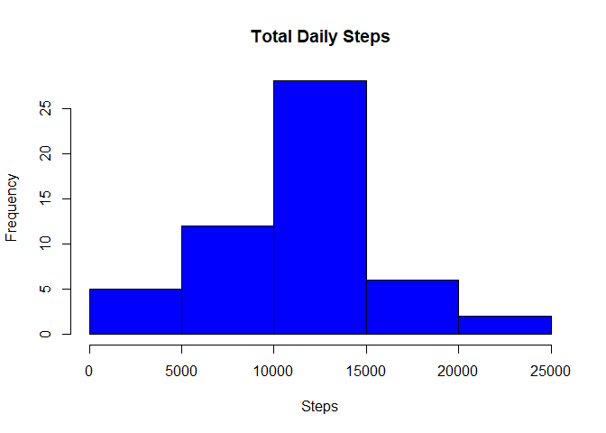
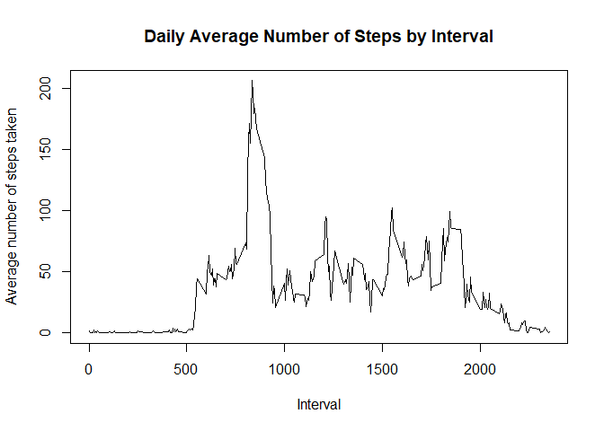
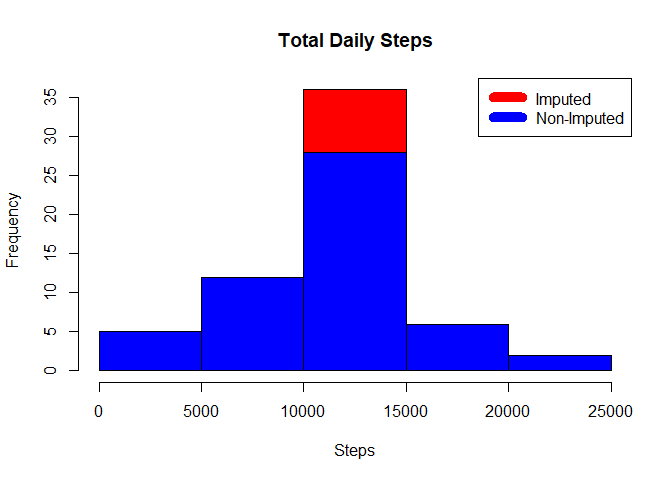
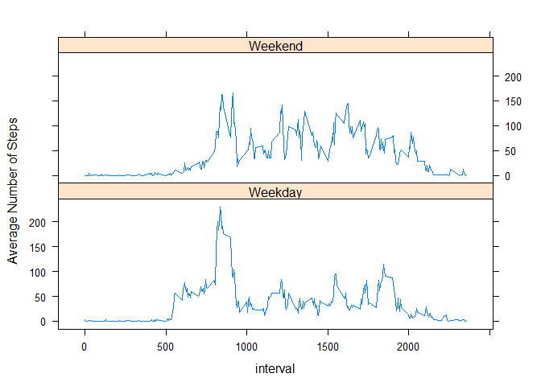

## I. Introduction
  It is now possible to collect a large amount of data about personal movement using activity monitoring devices. This device collects data at 5 minute intervals through out the day. The data consists of two months of data from an anonymous individual collected during the months of October and November, 2012 and include the number of steps taken in 5 minute intervals each day. The purpose of this report is analysing collected data from activity monitoring device and answer the questions below.

## II. Dataset and Variables

1. Dataset: [Activity monitoring data](https://d396qusza40orc.cloudfront.net/repdata%2Fdata%2Factivity.zip) <br>
The dataset is stored in a comma-separated-value (CSV) file and there are a total of 17,568 observations in this dataset.

2. Variables
  * steps: Number of steps taking in a 5-minute interval (missing values are coded as NA)
  * date: The date on which the measurement was taken in YYYY-MM-DD format
  * interval: Identifier for the 5-minute interval in which measurement was taken

## III. Analysis

1. Loading and preprocessing the data


```r
# Set the global echo = TRUE
# Load Data
if (!file.exists("activity.csv") )
    {
     fileurl <- 'http://d396qusza40orc.cloudfront.net/repdata%2Fdata%2Factivity.zip'  
     download.file(fileurl,destfile='repdata%2Fdata%2Factivity.zip',mode='wb')  
     unzip('repdata%2Fdata%2Factivity.zip')
    }

# Read Data
Data <- read.csv("activity.csv")

# Look at the Data
summary(Data)
```

```
##      steps                date          interval     
##  Min.   :  0.00   2012-10-01:  288   Min.   :   0.0  
##  1st Qu.:  0.00   2012-10-02:  288   1st Qu.: 588.8  
##  Median :  0.00   2012-10-03:  288   Median :1177.5  
##  Mean   : 37.38   2012-10-04:  288   Mean   :1177.5  
##  3rd Qu.: 12.00   2012-10-05:  288   3rd Qu.:1766.2  
##  Max.   :806.00   2012-10-06:  288   Max.   :2355.0  
##  NA's   :2304     (Other)   :15840
```

```r
str(Data)
```

```
## 'data.frame':	17568 obs. of  3 variables:
##  $ steps   : int  NA NA NA NA NA NA NA NA NA NA ...
##  $ date    : Factor w/ 61 levels "2012-10-01","2012-10-02",..: 1 1 1 1 1 1 1 1 1 1 ...
##  $ interval: int  0 5 10 15 20 25 30 35 40 45 ...
```

2. What is mean total number of steps taken per day?

  i) Calculate the total number of steps taken per day
  

```r
StepsPerDay <- aggregate(steps ~ date, Data, sum)
```
  
  ii) Make a histogram of the total number of steps taken each day
  

```r
hist(StepsPerDay$steps, main = "Total Daily Steps",xlab="Steps", col="blue")
```

<!-- -->
  
  iii) Calculate and report the mean and median of the total number of steps taken per day <br>
  * Mean: The average total number of steps taken per day is 10766 steps.
    

```r
MeanStepsPerDay <- mean(StepsPerDay$steps)
MeanStepsPerDay
```

```
## [1] 10766.19
```
  * Median: The middle value (50%) of daily total number of steps taken is 10765 steps.
    

```r
MedianStepsPerDay <- median(StepsPerDay$steps)
MedianStepsPerDay
```

```
## [1] 10765
```

3. What is the average daily activity pattern?

  i) Make a time series plot (i.e. type="l") of the 5-minute interval (x-axis) and the average number of steps taken, averaged across all days (y-axis)
  

```r
# Calculate daily average steps across all days
StepsInterval <- aggregate(steps ~ interval, Data, mean)

# Plot the daily average steps by Interval
plot(StepsInterval$interval, StepsInterval$steps, type="l", main = "Daily Average Number of Steps by Interval", xlab="Interval", ylab="Average number of steps taken")
```

<!-- -->
 
  ii) Which 5-minute interval, on average across all the days in the dataset, contains the maximum number of steps? <br>
  * The Interval 835 contains the max number of average number of steps (206 steps).
  

```r
# Maximum number of steps
MaxSteps <- max(StepsInterval$steps)
MaxSteps
```

```
## [1] 206.1698
```

```r
# Interval contains the max number of steps
MaxInterval <- StepsInterval[which.max(StepsInterval$steps),1]
MaxInterval
```

```
## [1] 835
```

4. Imputing missing values

  i) Calculate and report the total number of missing values in the dataset (i.e. the total number of rows with NAs) <br>
  * It is n=2,304 as the total number of missing values in the dataset.
  

```r
TotalNA <- sum(!complete.cases(Data))
TotalNA
```

```
## [1] 2304
```

  ii) Devise a strategy for filling in all of the missing values in the dataset. The strategy does not need to be sophisticated. For example, you could use the mean/median for that day, or the mean for that 5-minute interval, etc.
  

```r
AverageSteps <- aggregate(steps ~ interval, data=Data, FUN=mean)
fillNA <- numeric()
  for (i in 1:nrow(Data)) {
      obs <- Data[i, ]
        if (is.na(obs$steps)) {
          steps <- subset(AverageSteps, interval == obs$interval)$steps
           } 
      else {
        steps <- obs$steps
    }
    fillNA <- c(fillNA, steps)
  }
```

  iii) Create a new dataset that is equal to the original dataset but with the missing data filled in.
  

```r
NewData <- Data
NewData$steps <- fillNA
```

  iv) Make a histogram of the total number of steps taken each day and Calculate and report the mean and median total number of steps taken per day. Do these values differ from the estimates from the first part of the assignment? What is the impact of imputing missing data on the estimates of the total daily number of steps? <br>
  * Means are same, but the median is increased (+1.188679). Imputing missing data affects the 10,000 - 15,000 step interval; the frequency is increased to 35 from 27.5.


```r
# Create histograms
NewSteps <- aggregate(steps ~ date, data=NewData, sum)
hist(NewSteps$steps, main="Total Daily Steps", xlab="Steps", col="red")
hist(StepsPerDay$steps, main = "Total Daily Steps", xlab="Steps", col="blue", add=T)
legend("topright", c("Imputed", "Non-Imputed"), col=c("red", "blue"), lwd=10)
```

<!-- -->

```r
# Calculate New Mean and Median
NewMean <- mean(NewSteps$steps)
NewMean
```

```
## [1] 10766.19
```

```r
NewMedian <- median(NewSteps$steps)
NewMedian
```

```
## [1] 10766.19
```

```r
# Compare to Non-Imputed Mean and Median
c(MeanStepsPerDay, NewMean)
```

```
## [1] 10766.19 10766.19
```

```r
c(MedianStepsPerDay, NewMedian)
```

```
## [1] 10765.00 10766.19
```

```r
NewMedian - MedianStepsPerDay
```

```
## [1] 1.188679
```

5. Are there differences in activity patterns between weekdays and weekends?

  i) Create a new factor variable in the dataset with two levels – “weekday” and “weekend” indicating whether a given date is a weekday or weekend day.
  

```r
NewData$date <- as.Date(NewData$date, format = "%Y-%m-%d")
NewData$day <- weekdays(NewData$date)
NewData$weekdays <- NewData$day %in% c("Monday", "Tuesday", "Wednesday", "Thursday", "Friday")
NewData$weekend <- !NewData$weekdays
```

  ii) Make a panel plot containing a time series plot (i.e.type="l") of the 5-minute interval (x-axis) and the average number of steps taken, averaged across all weekday days or weekend days (y-axis). <br>
  * The average number of steps are more spread over the intervals in weekend.
  

```r
# Calculating the average number of steps in weekdays
WeekdaysData <- NewData[NewData$weekdays,]
StepsInWeekdays <- aggregate(steps ~ interval, WeekdaysData, mean)

# Calculating the average number of steps in weekend
WeekendData <- NewData[NewData$weekend,]
StepsInWeekend <- aggregate(steps ~ interval, WeekendData, mean)

# Merging Data
StepsInWeekdays$day <- "Weekday"
StepsInWeekend$day <- "Weekend"
WeekData <- rbind(StepsInWeekdays, StepsInWeekend)
WeekData$day <- as.factor(WeekData$day)

# Making a panel plot
library(lattice)
xyplot(steps ~ interval|day, data=WeekData, layout=c(1, 2), type="l", ylab="Average Number of Steps")
```

<!-- -->
